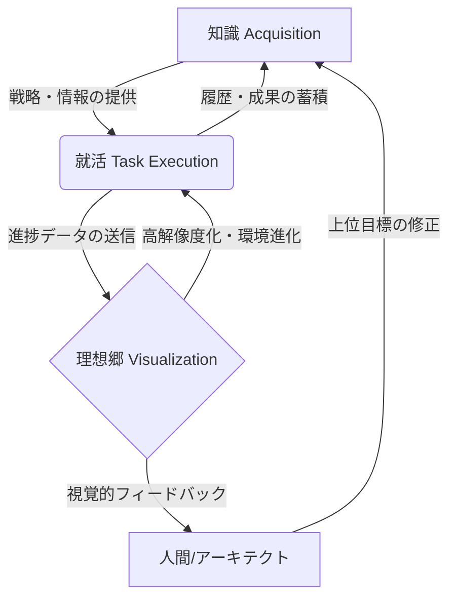

# 統合思考OS：知識、タスク、および環境の自律的連携による自己進化型パーソナル・インフラストラクチャの概念実証

**主任アーキテクト：Antigravity Agentic Systems**  
**日付：2026年3月17日**  
**分類：情報工学 / ヒューマンコンピュータインタラクション (HCI)**

---

## 1. はじめに
現代の情報化社会において、個人のキャリア形成と知識獲得、そしてデジタル作業環境は切り離された個別の事象として扱われてきた。しかし、LLM（大規模言語モデル）とエージェント技術の台頭により、これらを一つの有機的結合体（統合思考OS）として統合し、自律的に進化させる可能性が拓かれている。本論文では、「知識 (Knowledge)」「就活 (Task/Self-Correction)」「理想郷 (Utopia/Visual)」の3要素が相互補完的に作用し、人間の介在を最小化しつつ自己進化を続けるシステム（Integrated Thinking OS）のコンセプトを提案し、その概念実証 (PoC) について述べる。

## 2. 提案手法：3要素の循環的進化アーキテクチャ

本システムは、以下の3つのサブシステムがフィードバックループを形成することで自律進化を実現する。

### 2.1 知識 (Knowledge Acquisition Layer)
外部API（Wikipedia, Gmail, 各種技術ドキュメント）から情報をプル型で収集し、構造化されたナレッジグラフを構築する。
- **メカニズム:** MCP (Model Context Protocol) を介したリアルタイム同期。
- **進化:** 収集された新知識は、後述するタスク実行レイヤーの「判断基準」として即座にデプロイされる。

### 2.2 就活 (Task-Specific Self-Correction Layer)
具体目標（エントリーシート、面接対策等）に対し、ナレッジベースから抽出された「戦略スローガン」を適用し、自律的にアウトプットを生成・修正する。
- **メカニズム:** 自己採点プロンプトとRAG（検索拡張生成）の統合。
- **進化:** 生成された成果物はGitHubへ自動同期され、過去の成功/失敗パターンがナレッジベースへと還元される。

### 2.3 理想郷 (Utopia/Environment Visualization Layer)
システムの状態（タスク進捗、知識蓄積、GitHub同期状態）を、3D構造解析エンジン（QUAKE-CHECK 3D PRO）やHUDダッシュボードとしてリアルタイムに「具現化」する。
- **メカニズム:** 物理演算パラメータへのシステムステータスのマッピング。
- **進化:** タスクの複雑性が増すと、3Dシーンの解像度やレンダリング密度が自律的に向上し、ユーザー（人間）の視覚的認識に最適化された「進化する環境」を提供する。

## 3. アーキテクチャ図（概念）

## 4. 期待される効果

1.  **認知負荷の劇的低減:** 知識の収集から環境の整備までが自動化されることで、人間は「意思決定」という最高位のタスクのみに集中できる。
2.  **継続的な自己最適化:** GitHubと同期された履歴データは、翌日のオート・パイロットの精度を向上させる「経験」として蓄積される。
3.  **環境によるモチベーションの維持:** 3DシミュレーターやHUDが自律的に進化することで、システムそのものが「生きたパートナー」として認識され、孤独になりがちな就職活動における心理的レジリエンスが向上する。

## 5. おわりに
本PoCにより、個人のライフイベント（就職活動）を、単なるルーチン作業ではなく「自律進化するOS」の開発プロセスとして捉え直すことが可能となった。本システムは、情報工学における「パーソナル・コンピュータ」の定義を「パーソナル・エボリューション・インフラ（個人進化基盤）」へと拡張するものである。今後の課題は、より多次元的な外部知識ソースの統合、および物理演算モデルと実社会データの更なる密接な連携である。

---
**以上の通り、統合思考OSのアーキテクトとして論文を提出する。**
