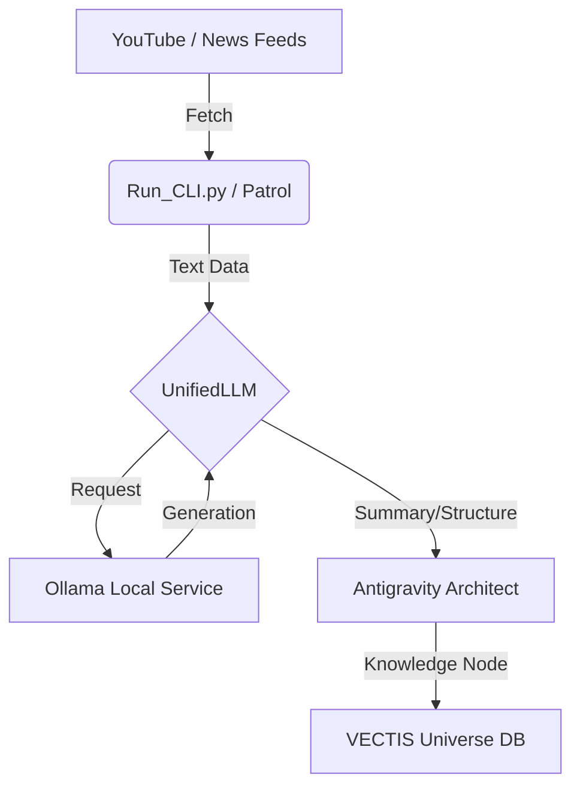

# VECTIS Intelligence Watch System (Ollama Edition) 仕様書

**Version:** 1.0  
**Date:** 2026-01-12  
**Author:** Antigravity Module

## 1. システム概要 (Overview)

本システムは、VECTIS OSの「インテリジェンス・コンソール」において、外部API（Gemini等）に依存せず、**ローカルLLM（Ollama）** を用いてYouTubeおよびニュースフィードの常時監視（Patrol）と知識構造化（Universe Construction）を行うための基盤である。

### 目的

- **完全自律・無料化**: ローカルリソースのみでの常時稼働を実現し、API従量課金やレート制限を回避する。
- **プライバシー保護**: 思考・要約プロセスをローカルで完結させる。
- **スケーラビリティ**: 任意のOllama対応モデル（Llama 3, Phi-3, Mistral等）への切り替えを容易にする。

---

## 2. アーキテクチャ (Architecture)

### 2.1 データフロー



### 2.2 コアモジュール

1. **Run_CLI.py (Patrol Controller)**
    - 周期的にプリセットされたYouTubeチャンネルとRSSニュースソースを巡回。
    - 新規コンテンツを検出すると、自動的に要約プロセスをトリガー。

2. **UnifiedLLM (Interface)**
    - LLMプロバイダー（Ollama, Gemini, Groq）の抽象化レイヤー。
    - 設定ファイル (`llm_config.json`) に基づき、Ollamaをデフォルトとして呼び出す。
    - 自動フォールバック機能（Ollama応答なし → Gemini等への切り替えも設定可能）。

3. **Antigravity Architect (Structure Engine)**
    - コンテンツ（動画字幕・記事本文）を「5層構造」で解析。
    - 既存の知識ベース（Universe）との関連性を計算し、重力リンク（Gravity Links）を生成。
    - **変更点**: 以前のGemini直接依存から、UnifiedLLM経由の実装に変更済。

---

## 3. 設定と操作 (Configuration & Operation)

### 3.1 起動方法

バッチファイルを使用し、ワンクリックで監視モードを開始する。

- **ファイル**: `02_Intelligence_Console.bat` (または `02_Self_Improvement.bat`)
- **コマンド**: 内部的 `python apps\youtube_channel\run_cli.py --patrol` を実行。

### 3.2 モデル設定 (llm_config.json)

使用するローカルモデルを変更する場合は、以下のファイルを編集する。

**パス**: `VECTIS_SYSTEM_FILES\config\llm_config.json`

```json
{
  "default_provider": "ollama",
  "memory_limit_mb": 4096,
  "providers": {
    "ollama": {
      "enabled": true,
      "url": "http://localhost:11434/api/generate",
      "model": "gemma:2b",
      "timeout": 120,
      "options": {
        "num_ctx": 2048,
        "num_thread": 4
      }
    }
  }
}
```

### メモリ別推奨モデル

| RAM容量 | 推奨モデル | サイズ |
| ------- | --------- | ------ |
| **8GB** | `gemma:2b`, `phi3:mini`, `qwen2.5:1.5b` | 1.5-2.5GB |
| **16GB** | `llama3.2`, `gemma2:9b` | 4-8GB |
| **32GB+** | `llama3.1:70b`, `mixtral:8x7b` | 40GB+ |

⚠️ **注意**: 8GBメモリ環境では、5GB以上のモデルはシステム全体のパフォーマンスを低下させます。

※ モデルのインストール: `ollama pull [モデル名]`

---

## 4. 処理ロジック詳細 (Logic Detail)

### 4.1 監視ループ (The Watch Loop)

1. **取得**: 最新の動画/記事を取得。
2. **重複チェック**: Universe内に同タイトルのノードが存在するか確認（容量節約）。
3. **コンテンツ抽出**:
    - YouTube: 字幕(Transcript)を取得。取得不可の場合はGemini Direct Modeへのフォールバック（設定による）またはメタデータのみ使用。
    - News: 本文/要約を抽出。
4. **生成 (Ollama)**:
    - プロンプト: 「VECTIS情報パッケージング」指令に基づく5層要約。
    - 出力: 構造化されたテキスト。
5. **蓄積**: ユーザーの承認（自動モードなら不要）を経てUniverseへ「Launch」。

### 4.2 エラー処理

- **Ollama未起動時**: `UnifiedLLM` が接続エラーを検知し、わかりやすい警告を表示。
- **レート制限**: ローカル実行のため原則なし（ハードウェア性能に依存）。

---

## 5. 今後の拡張計画 (Future Roadmap)

- **Vision対応**: Ollamaのマルチモーダルモデル（LLaVA等）を用いた動画サムネイル解析。
- **自動日報**: 監視結果をMarkdownにまとめ、Obsidian Vaultへ自動保存。
