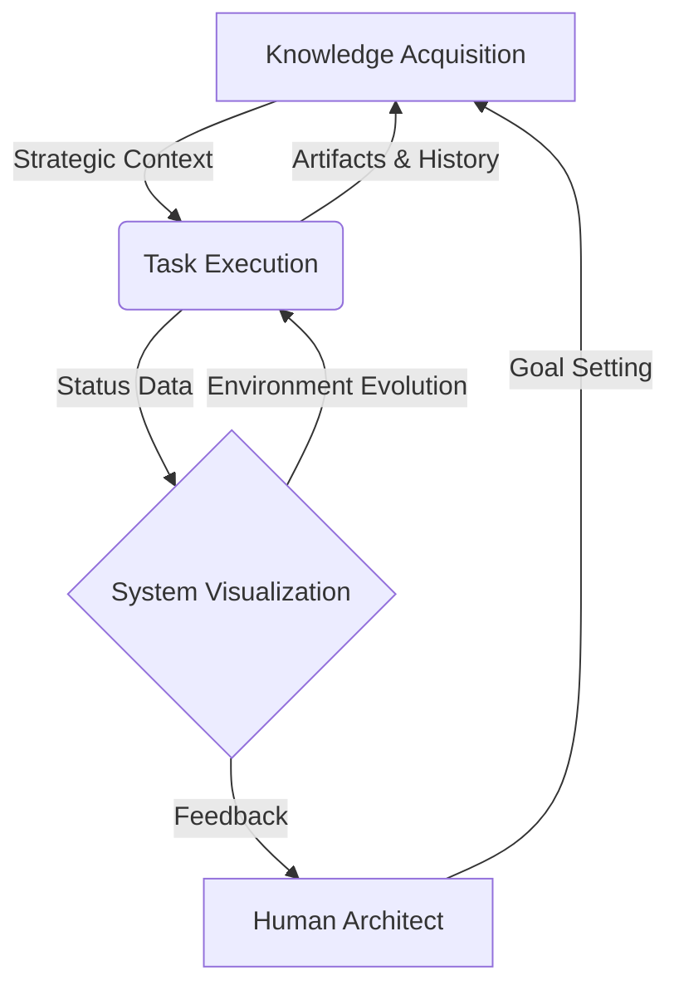

# Antigravity: Self-Expanding Thinking OS

> **"From Personal Computing to Personal Evolution Infrastructure"**

Antigravityは、知識の獲得 (Knowledge)、具体的な目標達成 (Execution)、および作業環境の可視化 (Visualization) を三位一体で統合し、自律的に進化し続ける「自己拡張型思考OS」の概念実証 (PoC) プロジェクトです。

---

## 🚀 Concept: The Triple-Helix Evolution

本システムは、以下の3つのサブシステムがフィードバックループを形成することで、ユーザーの思考と行動を拡張します。

### 1. Knowledge Acquisition Layer (知識の自律的統合)
外部の膨大な情報ソース（Wikipedia, 技術ドキュメント, 各種API）から、MCP (Model Context Protocol) を介してリアルタイムに情報を収集・構造化します。
- **特徴:** プル型の情報収集と、RAG（検索拡張生成）に最適化されたナレッジグラフの構築。
- **進化:** 蓄積された知識は、即座に「意思決定の判断基準」としてシステム全体にデプロイされます。

### 2. Task-Specific Execution Layer (戦略的自己修正)
具体的な目標（例：高度なドキュメンテーション、戦略立案、キャリアビルディング）に対し、ナレッジベースから抽出された「戦略的知見」を適用し、自律的にアウトプットを生成・洗練させます。
- **特徴:** 自己採点プロンプトとフィードバックループによる、成果物の自動修正とGitHubへの自動同期。
- **進化:** 過去の成功・失敗パターンを「経験」としてナレッジベースへ還元し、次回の精度を向上させます。

### 3. Environment Visualization Layer (環境の具現化とHUD)
システムの内部状態（タスクの進捗、知識の密度、同期ステータス）を、3D構造解析やHUDダッシュボードとしてリアルタイムに「具現化」します。
- **特徴:** 物理演算パラメータへのシステムステータスのマッピングによる、直感的な状況把握。
- **進化:** システムの複雑性が増すにつれ、可視化の解像度やレンダリング密度が自律的に向上し、ユーザーに「進化する環境」を提供します。

---

## 🛠️ Architecture

---

## 🌟 Philosophy

本プロジェクトは、情報工学における「パーソナル・コンピュータ」の定義を、単なる計算機から**「個人進化基盤 (Personal Evolution Infrastructure)」**へと拡張することを目指しています。

「未知への探求心」をエンジンの中心に据え、人間は「意思決定」という最高位のクリエイティブ・タスクに集中し、それ以外の「仕組みの構築と最適化」をシステムが自律的に担う未来を具現化します。

---

## 📁 Repository Structure (Core Components)

- `docs/`: 統合思考OSの仕様・論文・戦略ドキュメント
- `projects/`: 自律エージェントによる開発成果物
- `tools/`: MCPコネクタ、自動化スクリプト、クリーンアップツール
- `dashboard/`: システムステータス可視化用HUD
- `temp/`: プロトタイプおよび概念実証用サンドボックス

---

## 📝 Future Roadmap

- [ ] 多次元外部知識ソースの更なる統合 (Financial, Logistics, Heavy Industry datasets)
- [ ] 物理演算モデルと実社会データの密接な連携
- [ ] マルチエージェントによる自律的なリサーチプロトコルの確立

---
**Developed by Antigravity Agentic Systems**
